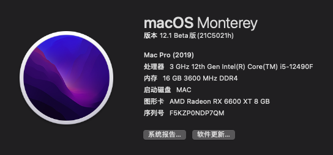

# BIOSTAR-B660T Silver itx Hackintosh OpenCore EFI

### OpenCore

[OpenCore 0.9.7](https://github.com/acidanthera/OpenCorePkg)

### OS Version Tested

- macOS Monterey 12.x
- macOS Ventura  13.x 

### Hardware

- Motherboard: BIOSTAR B660T Silver itx
- Bios Version: B66BY225.BST
- CPU: Intel i5-12490F
- GPU: Sapphire RX6600XT
- Disk: Corsair MP600 1T
- Audio: Realtek ALC256
- Ethernet: Realtek PCle 2.5GbE Family Controller
- Wireless: Broadcom BCM94360CS2

### Bios Setup

| Name | Option |
| ----- | --- |
| Advenced → CPU Configuration →  C6DRAM | Enabled |
| Advenced → CPU Configuration →  Intel (VMX) Virtualization Technology | Enabled |
| Advenced → SATA Mode Selection | AHCI |
| Chipset → System Agent (SA) Configuration → Internal Graphics | Disabled|
| Chipset → System Agent (SA) Configuration → Primary Display | PCH PCI |
| Chipset → System Agent (SA) Configuration →  VT-d | Disabled |
| Chipset → System Agent (SA) Configuration →  Above 4GB MMIO BIOS assignment | Enabled |
| Boot → Boot Configuration → Fast Boot | Disabled |
| Boot → Boot Configuration → CSM Support | Disabled |
| Security → System Mode → Secure Boot | Disabled |
| Tweaker → CPU Power Management → CFG Lock | Disabled |
| Tweaker → GT Power Management → RC6(Render Standby) | Disabled |

### Notes

 - Use suitable [OpenCore Configurator](https://mackie100projects.altervista.org/opencore-configurator/) build your SMBIOS

 - If you use 12th Gen small core CPU like 12600KF , U must change Config.plist

 - Config.plist - Kernel - ProvideCurrentCpuInfo - Ture

### ScreenShot 

- About This Mac

### Contact Us 

- QQ Group: 23304408

### Thanks 
 This EFI is mainly contributed by Bilibili uper [乌龙蜜桃来一打](https://space.bilibili.com/244390800/?spm_id_from=333.999.0.0) which edited on his [B660GTN](https://github.com/hackintosh-efi/BIOSTAR-B660GTN-OpenCore) EFI.

Thanks for this cool guy!
